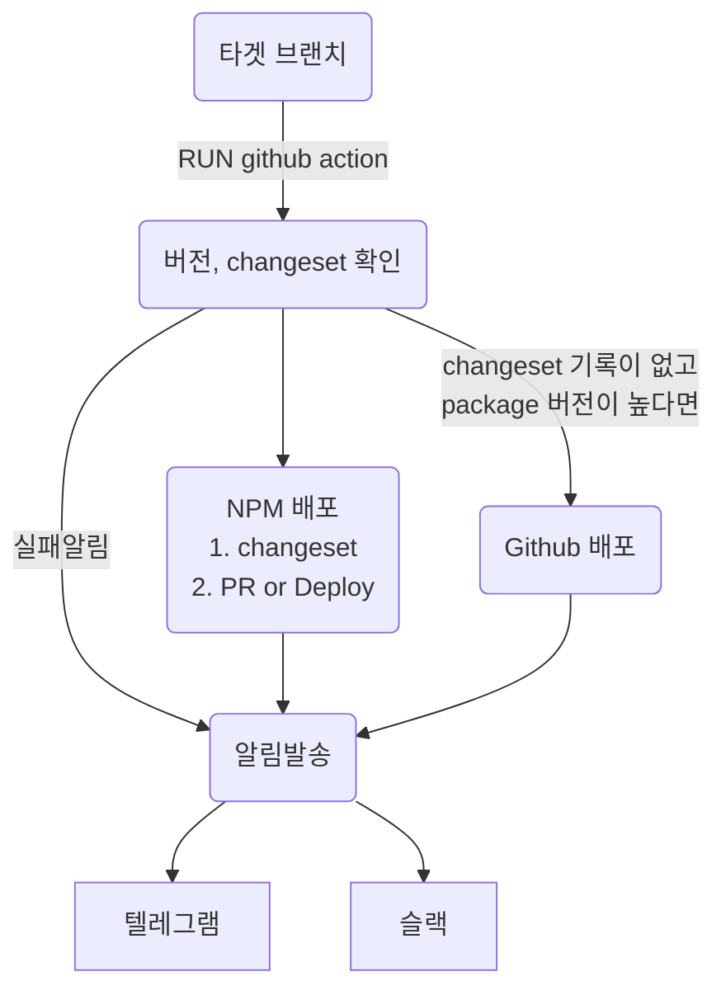
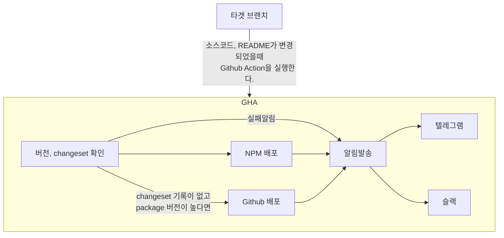

# 쾌적한 노드 패키지 배포

changeset이 담겨있는 job을 실행한다고하면 2가지 액션만 실행된다

1. PR을 만들거나
2. 패키지를 배포하거나
3. **PR도 만들지 않고 패키지도 배포하지 않는다**

내가 원하는 3번째 옵션이 없었다.

곰곰히 생각해봤다. 당연히 main 브랜치에 push가되면 배포하거나 PR을 만드는게 당연한데?
배포가 항상 push할때만하는 것이 아니라고하면 이 문제는 해결될 것같다.

## install

- (require) semver
- (require) changesets

## Feature, TODO

- [x] `버전, changeset` github action 구성하기
- [ ] `NPM 배포` 실제 배포되는지 확인하기
- [ ] `Github 배포` 실제 배포되는지 확인하기
- [ ] `알림발송` 예시 구성하기

## Using, 사용하기

- `.github/workflows/deploy.yaml` 파일에서 144번째줄 수정하기
- `.github/workflows/deploy.yaml` 파일에서 156번째줄 수정하기
- `.github/config/check_version.sh` 파일에서 5번째줄 수정하기

- 참고
  - https://docs.github.com/ko/actions/using-jobs/defining-outputs-for-jobs
